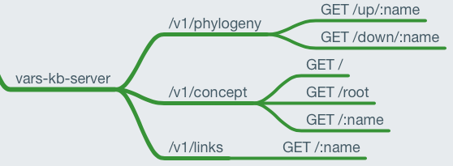

# vars-kb-server

This is a RESTful read-only service for retrieving information from MBARI's knowledgebase (KB). It can return:
 
 - the hierarchy of concepts (e.g. phylogeny) found in the KB; both ancestors (up) and descendants (down) for a given concept.
 - information about a specific concepts including alternate names, media and link-realizations (descriptions)
 - Links (linktemplates) that can be applied to a particular concept when annotating
 
 This server has dependencies on the [vars-kb](https://github.com/hohonuuli/vars-kb) project.

This project is built using [SBT](http://www.scala-sbt.org/)

## Getting Started

```
git clone https://github.com/hohonuuli/vars-kb-server
cd vars-kb-server
sbt pack
```

Or, to run it:

```
sbt 
jetty:start
// stop with 'jetty:stop'
```

## API

All returns are JSON objects



`GET /v1/phylogeny/up/:name` - Return the ancestors of 'name' (includes 'name')  
`GET /v1/phylogeny/down/:name` - Return the descendents of 'name' (includes 'name')  
`GET /v1/concept` - Return all concept names  
`GET /v1/concept/root` - Return the root concept  
`GET /v1/concept/:name` - Return the details (alternate names, media, descriptors) for 'name'  
`GET /v1/links/:name` - Return all link templates applicable to 'name'

## Deploy

1. Build with `sbt pack`
2. Configure JDBC properties for _production_ in `target/pack/conf/application.conf`
3. Build docker image: `docker build -t vars-kb-server`
4. Launch image: `docker run -d -p 6060:8080 vars-kb-server`
    - Omit the -d flag if you want to watch the debug output.
5. Endpoint will be accessible on port 6060.

## For End-users

The interchange format is JSON. Here's a few examples of working with JSON:

### Matlab

```
% Install JSONlab from https://www.mathworks.com/matlabcentral/fileexchange/33381-jsonlab--a-toolbox-to-encode-decode-json-files
r = urlread('http://localhost:6060/v1/phylogeny/down/Munnopsidae');
j = loadjson(r);
j.name              % The name of the root of the sub-branch (e.g. Munnopsidae)
j.children          % The descendants of Munnupsidae
```

### Python

```
import requests
r = requests.get('http://localhost:6060/v1/phylogeny/down/Munnopsidae')
import json
j = json.loads(r.text)
j['name']           % The name of the root of the sub-branch (e.g. Munnopsidae)
j['children']       % The descendants of Munnupsidae
```

### Ruby

```
require 'open-uri' 
r = URI('http://localhost:6060/v1/phylogeny/down/Munnopsidae').read
require 'json'
j = JSON.parse(r)
j['name']
j['children']
```

### R

```
install.packages("rjson") 
library(rjson)
j <- fromJSON(readLines('http://localhost:6060/v1/phylogeny/down/Munnopsidae'))
j$name
j$children
```

### JavaScript

```
// Using JQuery
$.getJSON('http://localhost:6060/v1/phylogeny/down/Munnopsidae', function(j) {
    //j is the JSON string
});
```

### Scala ([json4s](http://json4s.org/))

```
# Read using Scala std lib
val r = scala.io.Source.fromURL("http://localhost:6060/v1/phylogeny/down/Munnopsidae").mkString

# add a json4s library. In ammonite:
# import $ivy.`org.json4s::json4s-native:3.5.0`, org.json4s._, org.json4s.native.JsonMethods._

import org.json4s._
import org.json4s.native.JsonMethods._
val j = parse(r)

# You need the following to extract values
implicit val formats = DefaultFormats

j \ "name"
(j \ "name").extract[String]

# You can alternatively map the JSON to scala case classes.
```